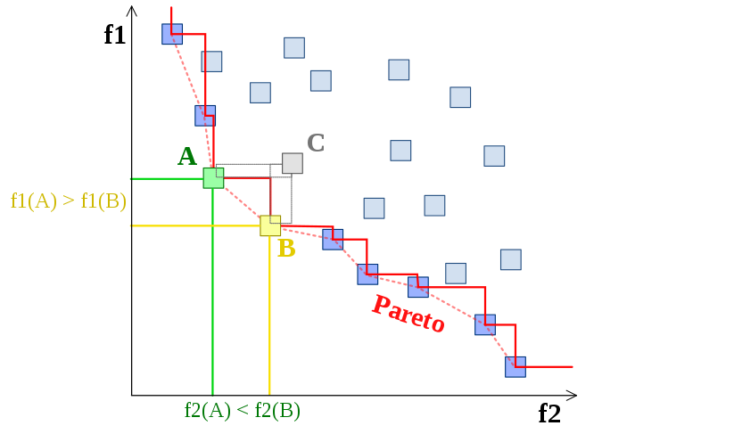
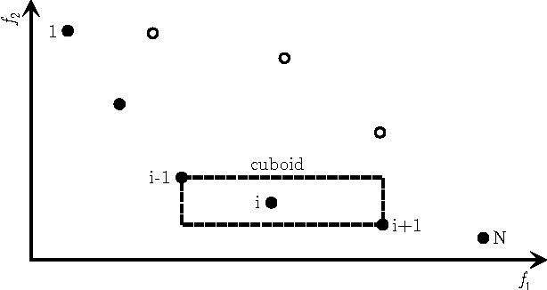
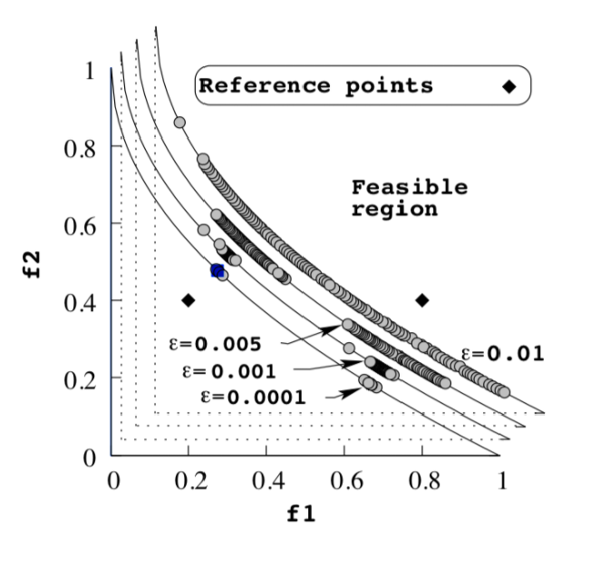

Algoritmos
----------

En ``warehouse_allocation`` se han implementado diferentes algoritmos genéticos, los cuales son ``NSGA-II`` :cite:`2002:Deb`,
``NSGA-III`` :cite:`2014:Deb`, ``RNSGA-II`` y el algoritmo ``UNSGA-III`` :cite:`2016:Seada`.

Un algoritmo genético necesita de operadores matemáticos que hagan evolucionar a la población a lo largo del tiempo. Dichos operadores imitan
los procesos evolutivos de las especies en la vida real. Los operadores esenciales son los de **Sampling**, **Selection**, **Survival**, 
**Crossover**, y **Mutation**

En este proyecto, se le llama individuo a una alocación de SKUs o **slotting** de algún centro de distribucción. Matemáticamente, si :math:`C`
es la cantidad de clusters (pasillos) y :math:`Q` es la cantidad de SKUs, entonces un individuo es representado por la matriz 

.. math::

    (x_{k,i})_{(k,i)\in C\times Q}

Una población es un conjunto de slottings en su forma matricial, que se hacen evolucionar desde una configuración inicial (desde el Sampling) para
conseguir un resultado óptimo.

Pareto Front
~~~~~~~~~~~~

En problemas de optimización multi-objetivo, generalmente, no es posible encontrar una solución única que optimize todas las funciones objetivos
simultaneamente, lo que uno encuentra es una familia de soluciones óptimas llamadas **Soluciones de Pareto optimales**, que usualmente se llaman
el **Pareto Front** o **Pareto Set**. Supongamos que intentamos minimizar simultaneamente :math:`m` funciones :math:`f_k` con :math:`k = 1,2, ..., m`
en cierto conjunto feasible, que llamemos :math:`F`. Cualquier :math:`x\in F` es llamado solución feasible del problema de optimización (en nuestro problema,
cualquier slotting que cumpla las restricciones de peso, capacidad de cada uno de los pasillos, y ubicado en un único lugar, es una solución feasible).
Se dice que la solución feasible :math:`x^{\ast}` domina a :math:`x` si 

.. math::
   :nowrap:

   \begin{eqnarray}
   
      f(x^{\ast}_j) & \leq & f(x_j) \hspace{0.5cm} \forall j = 1,2, ..., m\\
      f(x^{\ast}_j)  & < & f(x_j) \hspace{0.5cm}  \text{Para un} \hspace{0.1cm} j\\

   \end{eqnarray}

Esto nos dice que :math:`x^{\ast}` domina a :math:`x` cuando es mejor en al menos una función objetivo, y no es peor en ninguna de las otras.

Por lo tanto, el conjunto Pareto Front, es el conjunto de soluciones que no son dominadas por ninguna otra solución.

NSGA-II
~~~~~~~

Este algoritmo también es conocido como *The elitist nondominated sorting genetic algorithm*. Es un algoritmo elitista por que en cada
iteración compiten los miembros de la población por seguir siendo parte de esta, donde los individuos más capaces son los que son
**Pareto Dominantes** :cite:`2013:Santana`. 

El algoritmo ``NSGA-II`` se puede resumir en los siguientes pasos

* 1. Seleccionar la cantidad de iteraciones :math:`T`, el tamaño de la población :math:`N` y la cantidad de descendientes a generar en cada iteración :math:`N_0`, y generar la población inicial :math:`P_0` y descendientes :math:`S_0 = \emptyset`.

* 2. En la iteración :math:`t`, generar la población parcial :math:`W_t = P_{t}\cup S_{t}`, al combinar los padres y descendientes

* 3. Asignar un *ranking* a la población :math:`W_t` basado en la **Dominancia de Pareto** y en **Crowding Distance**.

* 4. Generar :math:`P_{t+1}` a partir de los :math:`N` primeros individuos ordenados de menor a mayor ranking (Survival).

* 5. Seleccionar los **mejores individuos** (Selection) de :math:`P_{t+1}` para aplicar los operadores Crossover y Mutation hasta generar los offspring :math:`S_{t+1}` de tamaño :math:`N_0`

* 6. Si :math:`t\geq T` terminar, en otro caso volver al punto 2.

El proceso de asignación de ranking es el siguiente: Dada una población de soluciones **feasibles**, un individuo tiene ranking :math:`0`,
si es que es Pareto Dominante (miembro del Pareto Front), tiene ranking :math:`1` si es que hay **solo un** individuo que lo domina, y así sucesivamente.
Los individuos con menor ranking son los más *aptos*. En los Pareto Front, se les da un ranking adicional a los individuos basado en la **Crowding Distance**
que permite a su vez, seleccionar a los mejores individuos dentro de estos conjuntos. Esta mide la distancia (respecto a los valores de los objetivos)
del individuo con sus vecinos.

En la imagen se aprecia un Pareto Front, y la distancia del individuo :math:`i` a sus vecinos, es definida como la suma del lado inferior y lateral derecho
del rectángulo que se aprecia (Esto se generaliza de igual forma a más dimensiones i.e más objetivos). La idea de está distancia, es que mientras
mayor sea el valor, significa que el individuo es *más exclusivo*, pues se diferencia de sus vecinos (una especie de punto aislado en el Pareto Front, 
lo que significa que tiene un muy buen valor para alguno de los objetivos).

El proceso de selección por tanto es el siguiente: El individuo :math:`i` será seleccionado por sobre el individuo `j`, si es que tiene
**menor** ranking basado en la dominancia de Pareto. Si ambos tienen el mismo ranking, se escoge el que tiene **mayor** Crowding distance.

NSGA-III
~~~~~~~~

Escribir la doc!

RNSGA-II
~~~~~~~~~

Este algoritmo sigue exactamente las mismas ideas del algoritmo NSGA-II, pero no considera la **Crowding Distance**. Este algoritmo requiere
setear los llamados **reference points** y un valor de tolerancia :math:`\epsilon`. Estos puntos de referencia, simbolizan buenos valores para los objetivos, 
a los que se desearía aspirar, y por ende individuos cuyos objetivos estén a distancia menor a :math:`\epsilon` de alguno de estos puntos de 
referencia, serán considerados importantes dentro de la población.

El proceso de asignación de ranking es el siguiente: Se generán los diversos Pareto Fronts como fue descrito en el procedimiento
del algoritmo NSGA-II (ranking 0 son los no dominados, ranking 1 son los dominados por solo un individuo, etc.). 
Dentro de los distintos Pareto Fronts el ranking es 

UNSGA-III
~~~~~~~~~

Escribir la doc!